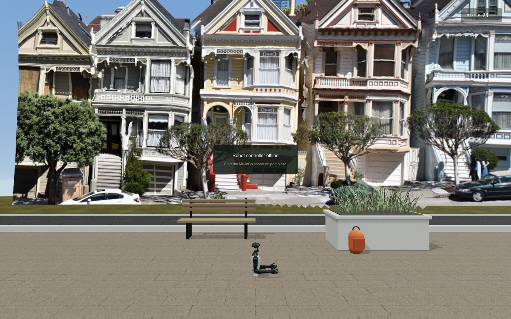
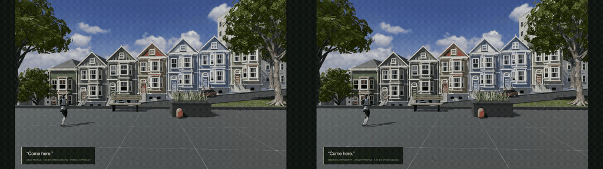
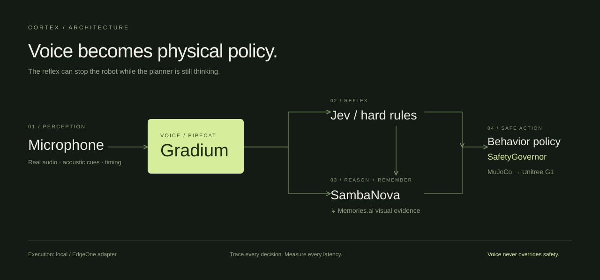
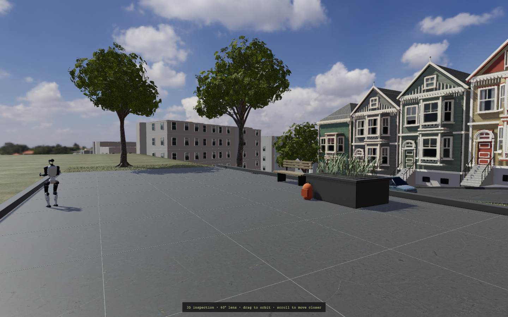

<div align="center">

# CORTEX

### A voice interface for the physical world.

**Same words. Different voice. Different physical response.**

[The demo · Indian English](public/media/CORTEX-demo-indian.mp4) · [Five-slide pitch](public/media/CORTEX-pitch.pdf) · [How it works](#the-system) · [Run locally](#run-cortex) · [Evidence](docs/ACCEPTANCE.md)



**Gradium** voice · **Pipecat** orchestration · **General Compute** inference (SambaNova fallback) · **MuJoCo** physics

</div>

Most voice-controlled robots understand words. CORTEX also turns measured vocal delivery into a physical behavior policy—then routes every action through an independent safety governor.

Say **“Come here.”** quietly. The G1 approaches at a measured pace. Reset, say the same words more emphatically, and its walking policy changes. Ask about a previously seen backpack, retrieve its actual camera evidence, and walk to that place. Say **“WAIT! STOP!”** and the reflex path interrupts without waiting for a language model.

This repository contains the app, simulator, voice service, tests, five-page pitch, and recorded demonstration. No locomotion training is required.

> **Honest build status:** MuJoCo runs real dynamics and an existing Unitree gait. DEMO inputs are explicitly synthetic acoustic fixtures. Gradium supplies STT/TTS; it does **not** supply the local acoustic heuristics or emotion labels. Provider calls require credentials. The Painted Ladies now use full-depth modeled architecture, with a 3D Alamo Square foreground. This is an authored approximation; photorealism acceptance remains open. The earlier partial scan is retained as hidden reference.



## Keyboard and voice share the same tools

Hold **W/A/S/D** or **arrow keys** to walk front/left/back/right relative to the robot. It turns toward the requested direction before moving. Release the key to pause. **Q/E** turn 90° in place; **Space** cancels the current movement; the next command starts normally. Pointer controls work the same way.

Say “move left one meter,” “turn right,” or “walk to the bench.” `turn`, `walk`, and `walk_to` are schema-validated shared tools. Explicit direction and named-target commands use these shared tools directly; conversational requests can select them through the configured inference provider. All motion passes the Jev/local reflex gate. With no credentials, the UI labels the deterministic planner DEMO and the reflex LOCAL. Keyboard commands use a renewable 650 ms lease, independent of the normal telemetry heartbeat.

If the status says **VIEW ONLY**, another tab owns control. Click **Use this tab** above the movement controls to transfer keyboard and voice control. CORTEX stops the previous session before granting the new one.

**Current validation:** 54 TypeScript tests, 8 MuJoCo physics tests and 4 Pipecat tests pass. The actual-browser keyboard suite checks all four walking directions, turn-before-walk, key release, blur, Space stop and waypoint navigation. [Keyboard results](docs/keyboard-results.json).

Generated Indian English speech also passed through the actual browser MediaStream and PCM worklet → live Gradium/Pipecat → shared tools → isolated MuJoCo: forward movement, spoken stop, right turn, backward movement and speech-reply playback. [Live browser voice evidence](docs/live-browser-voice-results.json). This is generated audio, not a human microphone trial. A fresh [live acoustic-policy comparison](docs/live-motion-results.json) returned the same “come here” transcript for two audio intensities: .55/.90 m/s limits and 1.45/2.21 m traveled over approximately three simulated seconds. Live movement uses local intensity/pitch heuristics; pauses alone do not require confirmation. This does not establish human emotion recognition.

The Indian English video, GIF and five-slide deck were refreshed with the current 3D scene and shared controls. Photorealistic scene acceptance remains open.

## The moment

| Same transcript | Physical policy | What you see |
|---|---|---|
| “Come here.” · moderate intensity | 0.55 m/s ceiling · 1.2 m space | Measured walk and approach |
| “Come here.” · high intensity | 0.90 m/s ceiling · 1.2 m space | Faster walking and shorter acknowledgement |
| Paused / hesitant delivery | 0.45 m/s ceiling · 2.0 m space · confirmation | Robot holds, then approaches cautiously |
| “WAIT! STOP!” | Cancel current movement | Motion command cancels before any planner call |

These are bounded design heuristics, not claims about a person's internal emotional state. Device gain and background noise affect acoustic measurements; live acceptance requires calibration and real microphone trials.

## The system



```text
Microphone PCM → Pipecat → Gradium streaming STT
                        + local measured acoustic cues
                              │
                 ┌────────────┴──────────────┐
                 │                          │
          hard-rule reflex            General Compute / SambaNova tools
          optional Jev                ↕ visual memory
                 │                          │
                 └────────────┬──────────────┘
                        BehaviorPolicy
                              ↓
                        SafetyGovernor
                              ↓
                      MuJoCo / Unitree G1
                              ↓
                  safe response → Gradium TTS
```

**Inference · General Compute / SambaNova.** The adapter selects configured General Compute first and supports SambaNova’s structured function-calling endpoint as a fallback. CORTEX measures observed request and action timings; it does not substitute advertised provider latency for local measurements.

**Voice · Gradium.** Streaming transcription and synthesized replies use the official Pipecat Gradium services. Credentials stay server-side. Interim STOP transcripts reach the reflex path immediately.

**Orchestration · Pipecat.** A Python pipeline handles PCM audio, transcription frames, turn boundaries, interruption, and speech output. Structured robot planning stays in the TypeScript control runtime, across a deliberate safety boundary.

**Memory · Memories.ai.** Captured camera evidence is indexed locally in DEMO or uploaded in REAL mode. A provider evidence ID must match a recorded waypoint before a retrieved sighting can authorize navigation. No invented confidence scores.

**Execution · local / EdgeOne.** Health checks and constrained software operations have adapters. No model can request an arbitrary shell command. Cloud deployment is optional and not claimed complete.

## A real 3D place

The robot walks on a bounded park path in **Alamo Square, facing the Painted Ladies in San Francisco**.

The houses use full-depth authored architecture: side and rear walls, roofs, projecting bays, recessed sash windows, entry stairs, rails and trim. The park path, grass slope, bench, planter and backpack are also 3D geometry. The robot's position and joints come from MuJoCo physics.

Use **Inspect 3D scene** or the **60°** button to check depth and parallax. Reality Mode restores a fixed phone-height camera with a 60° lens. Scanned surface materials, bent-leaf trees, HDR daylight, shadow maps and contact occlusion support the render.

The latest pass adds distinct roof and gable ornament, varied curtains and shades, local reflections in dielectric window glass, parked cars, richer nearby façades, and terrain-aligned trees and grass. These are authored improvements, not a new reality capture.



The earlier [jtressle scan](https://sketchfab.com/3d-models/san-francisco-painted-ladies-cf5aeb7fb0ac4152b43f72ce1dac60d6), **CC BY 4.0**, remains bundled as hidden reference. It was rejected as too shallow for the requested demo. The current architecture solves the missing volume, but it is still an inferred model, not an indistinguishable digital twin. [Scene status and remaining work](docs/SCENE_STATUS.md).

Physics uses separate collision geometry. A park curb bounds the walking area; no mission enters Steiner Street. [SCENE_CAPTURE.md](docs/SCENE_CAPTURE.md) documents how to replace the foreground with measured park capture. [Asset provenance](public/assets/painted-ladies/SOURCE.json) includes the source URL, license and GLB checksum.

## Run CORTEX

Requires Node.js 22+, Python 3.12, and a browser with WebGL2. Chrome is used for the supplied browser tests. No GPU training environment is needed for the frozen gait.

```sh
git clone https://github.com/KaushikSiva/cortex.git
cd cortex
npm ci
uv venv .venv --python 3.12
uv pip install --python .venv/bin/python -r robot/requirements.txt -r voice/requirements.txt
cp .env.example .env.local
npm run local
```

Open **http://localhost:3000**. The launcher starts MuJoCo on `8002`, Pipecat on `8003`, and the web/control runtime on `3000`. All services bind to loopback.

Without credentials, choose the labeled DEMO controls. To enable live voice, configure:

```dotenv
GRADIUM_API_KEY=
GRADIUM_VOICE_ID=lt88kyLfD8Mqemla
SAMBANOVA_API_KEY=
MEMORIES_API_KEY=
```

`GRADIUM_VOICE_ID` enables automatic synthesized replies after safe voice-command handling, plus replay with the speaker button. `GRADIUM_API_KEY` enables transcription. `GENERAL_COMPUTE_API_KEY` enables the configured conversation/planner provider; `SAMBANOVA_API_KEY` is the supported fallback. The Memories.ai key enables its corresponding live adapter. Restart all services after changing configuration. Never commit `.env.local` or paste keys into chat.

Additional variables, including Jev and EdgeOne, are in [.env.example](.env.example). AgentX is not part of this build.

## The demo script

1. Open Reality Mode. Say calmly: **“Come here.”**
2. Reset. Say more urgently: **“COME HERE!”**
3. Reveal CORTEX Mode. Compare measured acoustic cues, policy, speed and trace.
4. Capture scene memory. Ask: **“Where did you last see my backpack?”**
5. Say: **“Take me there.”**
6. While moving: **“WAIT! STOP!”** Inspect actual command and settling latency.
7. Say: **“Continue, but slowly.”**

Without live keys, use the corresponding DEMO controls. The included video uses synthetic acoustic fixtures, actual MuJoCo dynamics, and generated narration. [Full provenance](docs/DEMO.md).

**Combined demo:** capture a memory, then choose **I really need my backpack · DEMO**. Retrieval feeds actual evidence to a bounded planning step. Hesitation requests confirmation before the robot heads to the retrieved waypoint.

## Safety is a separate system

- STOP preempts planning and confirmation, including “Yes—wait, stop.”
- Velocity, approach speed, and personal space have hard bounds.
- Stale commands, stale telemetry, obstacles, falls, and heartbeat loss prevent movement.
- Motion has a deadline; STOP cancels current and pending movement without locking future commands.
- Tool arguments are schema-validated; evidence constrains memory navigation.
- Acknowledgement and physical settling are measured separately.

This is a simulation prototype, not a certified controller for physical hardware.

## Test and record

```sh
npm test
npm run build
.venv/bin/python robot/test_robot.py
.venv/bin/python voice/test_voice.py
# With the three local services running, one operator at a time:
node scripts/test-integration.mjs
node scripts/test-browser.mjs
node scripts/capture.mjs
python3 scripts/narrate.py
node scripts/render-pitch.mjs
```

The example voice ID selects Michelle, listed by Gradium as Indian English. Live TTS through Pipecat was verified separately in [the speech-output evidence](docs/gradium-tts-live-results.json). Restart the voice sidecar and web runtime after changing the voice ID.

The Pipecat protocol test uses a local Gradium test double. It validates the actual pipeline mechanics without claiming to exercise the cloud service. The recording scripts use Chrome and ffmpeg; narration uses macOS system speech.

## Repository map

```text
src/app/                   Next.js control room and Reality Mode
src/emotion/voicePolicy.ts  Documented acoustic-to-behavior mapping
src/cognition/             Planning, memory, reflex and mission lifecycle
src/integrations/          Gradium bridge, SambaNova, Memories.ai, Jev, EdgeOne
src/robot/                 Backend adapter and safety governor
src/scene/                 Painted Ladies architecture, 3D park and optional splat loader
voice/                     Pipecat service and measured PCM acoustics
robot/                     MuJoCo server and existing G1 gait inference
public/media/              Pitch deck, demonstration, GIF and screenshots
```

[Implementation notes](docs/IMPLEMENTATION_NOTES.md) · [Acceptance record](docs/ACCEPTANCE.md) · [Asset credits](docs/ASSETS.md) · [Deployment](docs/DEPLOYMENT.md)

CORTEX explores a simple question: **what changes when a robot can respond to the way a person speaks?**
